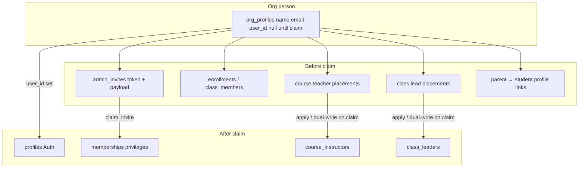

# Org profiles — unified organizational person plan

**Status:** planned  
**Supersedes:** staff-only `org_staff_profiles` slice (former title of this file).  
**Global Auth `profiles`:** unchanged (PK = `auth.users.id`).  
**Org SoT:** one **`org_profiles`** row per person in an organization — generalizing the existing [`student_profiles`](../database/SCHEMA.md) pattern. Auth account is optional until claim.

## Problem

Owners/admins need to:

1. **Add** people (staff, students, and later parents as relationships) with **name + email** without requiring an account or sending email immediately.
2. Optionally **send** a claim link later.
3. Let invitees see pending org access after signup (same email), without the magic link.
4. Assign **course teachers**, **class leads**, **enrollments**, and **class membership** **before** the person claims.
5. Allow **one person** to hold multiple privileges and relationships at once (e.g. a parent who is also a student in another class; a student who is also a teacher).

Today those concerns are split: pending staff live only on `admin_invites`; students already have org-scoped `student_profiles` with nullable `user_id`; parents are `parent_student_links` keyed on **`parent_user_id`**; `course_instructors` / `class_leaders` require **`user_id`**. There is no single org person row for staff before claim, and no unified directory for multi-role people.

## Locked decisions (still apply)

| Decision | Lock |
|----------|------|
| Auth `profiles` | Global; PK = `auth.users.id`. Not replaced by org profiles. |
| Org person SoT | **`org_profiles`** — one row per person per org (name + email; `user_id` null until claim). |
| Privileges vs relationships | **Org-level privileges** (owner / admin / instructor / observer — “teacher” in product language means instructor privilege + course assignment) live as **permissions on / via the claimed profile**. **Parent is not an org-level role** — it is a **relationship** to a specific student `org_profiles` row. |
| Multi-role | One person may hold multiple privileges and relationships at once (parent + student; student + instructor; etc.). |
| Claimed privilege layer | **`memberships`** remain the **claimed** privilege layer only (exclusive staff role + additive flags as today). No membership (and no permission) until `org_profiles.user_id` is set via claim. |
| Course / class config before claim | Allowed on the org profile; runtime privilege still requires claim + membership. |
| Families | Keep keying the directory off the **student** org profile row (same as today’s `student_profiles`); point FKs at the unified table. |
| Class / Family | Not billing or access containers. Course access stays enrollment + parent links (relationship), not family membership. |
| Observer | Never billing mutate; browse helpers as already locked on main. |
| Role vocabulary | Membership exclusive role is **`instructor`** (never “teacher” in schema). |

## Two kinds of “role”

```text
org_profiles (person in org)
├── Org-level privileges (claimed → memberships)
│     owner | admin | instructor | observer
│     → gates Collaborators, course manage, staff chrome, etc.
└── Relationships (can exist before or after claim)
      parent → specific student org_profile(s)   [not an org privilege]
      student context → enrollments, class_members, grade_level, student_email, …
      course teacher / class lead assignments → course_instructors / class_leaders
```

- **Privilege:** “Can this claimed person administer / instruct in this org?” → `memberships` (after claim).
- **Relationship:** “Is this person the parent of *that* student?” → link rows between two `org_profiles` (or profile ↔ profile), not a membership role named `parent` as the sole model.
- A person can be a **parent of one student** and a **student themselves** in another class (or the same org) because those are different attachments on the same `org_profiles` row.

## Architecture



| Piece | Role |
|-------|------|
| `org_profiles` | Canonical **person** in the org; generalizes today’s `student_profiles` |
| `admin_invites` | Claim channel; FK `org_profile_id`; keep `email` for inbox/RLS; payload may request privilege and/or relationship setup |
| Enrollments / class_members | Stay on the **student** org profile (same semantics as today) |
| Parent links | Point at **parent** `org_profiles` and **student** `org_profiles` (migrate off `parent_user_id`) |
| Course / class staff assignments | Prefer stable FK to `org_profiles`; privilege to *act* still requires claim + instructor/admin/owner membership |
| `memberships` | Claimed privilege layer only |
| Auth `profiles` | Global identity; linked via `org_profiles.user_id` |

**Out of scope for first ship (unless needed for merge):** rewriting discussions / events / announcement audiences onto org profiles; Track A billing Price IDs; Track B Connect.

## Product behavior

1. Owner/admin **Add person**: name + email (+ optional privilege and/or student fields) → `org_profiles`, **no** auto-email required.
2. **Send email** / copy link when ready (`send-organization-invite`).
3. Signup/login with invited email → pending invites on `/my`.
4. Before claim: enroll as student, assign course teacher / class lead, attach parent→student relationships.
5. **Claim**: set `org_profiles.user_id`; create/update **`memberships`** for requested **privileges**; materialize any staff assignment rows that still key on `user_id` during transition; parent relationships already on profile links become usable for access once claimed.
6. Multi-role: claiming a student invite on an existing staff profile (or the reverse) **merges onto one** `org_profiles` row when email/org match rules say so — does not create a second person.

Cancel pending: delete or soft-cancel invite; orphan rules for unclaimed profiles TBD in UI (do not delete a profile that still has enrollments / relationships without confirmation).

**Name on claim:** if Auth `profiles.name` is empty/default, set from `org_profiles.name`.

## Schema direction

### `org_profiles` (rename / evolve from `student_profiles`)

Preferred path: **rename `student_profiles` → `org_profiles`** (or introduce `org_profiles` and migrate student rows 1:1), then add fields needed for non-students:

- `id`, `organization_id`, `name` (required), `email` (nullable or required for inviteable people — lock in migration: staff pending needs email; students today allow email-less)
- `user_id uuid null` → Auth `profiles`, unique per org when set
- Student-only columns remain nullable on the unified row (`grade_level`, `student_email`, `parent_email` legacy, `created_via_course_id`, …) **or** move student-only attrs to a slim `org_profile_student_attrs` side table if the row gets too wide — default: **keep on the row** like today for less churn
- UNIQUE pending email / claimed user_id per org (same spirit as the former staff plan)

### Privileges (claimed)

- Continue to use **`memberships`** for exclusive `owner` / `admin` / `instructor` / `observer` and additive flags as already locked
- Setting privilege requires a claimed `org_profiles.user_id` matching `memberships.user_id`
- Pre-claim “intended privilege” may live on `admin_invites.role` (staff) until claim

### Relationships

- **Parent:** `parent_org_profile_id` → `student_org_profile_id` (replace `parent_student_links.parent_user_id`)
- **Student context:** presence of enrollments / class_members / student attrs — not a separate person table
- **Course teacher / class lead:** FK `org_profile_id` on assignment tables (dual-write `user_id` during cutover if needed)

### Invites

- `admin_invites.org_profile_id` required for person-anchored invites after backfill
- Parent invites attach **student org profiles** via `admin_invite_students` (already student-profile shaped)
- Same-email merge: if pending staff and pending/claimed student share `(organization_id, email)`, **one** `org_profiles` row — document conflict resolution (prefer merge; never two claimed `user_id`s for one email in one org)

## Migration concerns (must plan for)

| Area | Concern |
|------|---------|
| `student_profiles` | Rename or 1:1 migrate to `org_profiles`; update every FK (`enrollments`, `class_members`, grades, quizzes, invites, families, …) |
| `parent_student_links` | Today `parent_user_id` — must point at **parent `org_profiles`**. Unclaimed parents need a profile row first (invite creates it). |
| `course_instructors` / `class_leaders` | Today `user_id` — add/move to `org_profile_id`; claim dual-write; RLS/`can_manage_course` must still require active staff membership |
| Invite claim paths | Staff, parent, student claims all set `org_profiles.user_id` and adjust memberships / links |
| Collaborators UI | List from `org_profiles` + membership privileges + pending invites — not memberships alone |
| Billing | Track A meters **`student_profiles`** count — remeter as “org profiles that are students” (rows with student context / flag / enrollment history). Do **not** bill every staff-only profile as a student. |
| `get_org_person_profile` | Today keyed on `user_id` — directory should resolve via `org_profiles` (claimed and, for staff viewers, pending where product allows) |
| Same-email merge | Pending staff + student (or parent) same email → one profile; define claim order and privilege stacking |
| Families | Keep directory keyed on the **student** org profile; update FK name only |

### Hard backfill principles

1. One `org_profiles` row per existing `student_profiles` row (identity preserve ids if renaming).  
2. One `org_profiles` row per active staff membership `(organization_id, user_id)` when no student row already shares that `user_id` in the org; if a student row already has that `user_id`, **reuse it** and grant privilege via membership (multi-role).  
3. One pending profile per pending staff invite email when no row exists for that org+email.  
4. Rebuild parent links onto parent org profiles (create claimed parent profiles from `parent_user_id` + membership/email).  
5. Link all person-anchored `admin_invites` to `org_profile_id`.  
6. Verification: student FK counts unchanged; every staff membership has a profile; zero duplicate `(org, user_id)` / conflicting pending emails.

### Rollback / experiment mode

Prefer fixing forward in migrations. Local: `scripts/nuke.sh` if mid-migration backfill fails. Do not ship partial backfill to production until verification passes.

## App work (when implementing)

| Area | Changes |
|------|---------|
| Databridge / types | `org_profiles` as person API; regenerate `database.types.ts` |
| Org settings Collaborators | Add person; privileges; send invite; pending rows |
| Roster / courses | Pickers accept org profile id (pending or claimed) |
| Parent flows | Create/link parent org profiles; relationships UI |
| Edge `send-organization-invite` | Person name from org profile |
| Billing helpers | Student meter = student-context profiles only |
| Docs | SCHEMA, FEATURES, ORG_SETTINGS, domain AGENTS — mark **shipped** when done |

## Implementation todos

- [ ] Lock email nullability + student-context discriminator (column vs side table vs “has enrollment”) with Perry if product-facing
- [ ] Migration: `org_profiles` evolve/rename, relationship + assignment FKs, RLS, claim updates, **hard backfill**
- [ ] pgTAP: multi-role claim; parent link on profiles; staff placement; student enrollment preserved; merge same email
- [ ] App: Collaborators, pickers, parent directory, invite UX
- [ ] Billing meter remapping + Track A plan note
- [ ] FEATURES / SCHEMA / page docs → **shipped**

## Test plan

- Backfill: memberships + student_profiles + parent links + pending invites → consistent `org_profiles` with no duplicate people.  
- Claim staff with course placement → teaches after claim; unclaimed cannot manage.  
- Claim student on profile that is already a parent relationship → `is_student` / student access stacks; one profile.  
- Parent access still enrollment-gated via linked student profiles.  
- Family directory still lists student profiles (unified ids).  
- Billing count ignores staff-only profiles.  
- Manual: existing members still appear correctly in Collaborators after migration.

## References

- Schema today: [SCHEMA.md](../database/SCHEMA.md) (StudentProfile, Membership, Enrollment, ParentStudentLink, ClassMember, CourseInstructor)  
- Former staff-only approach: replaced by this document (same path historically `ORG_STAFF_PROFILES.md`)
