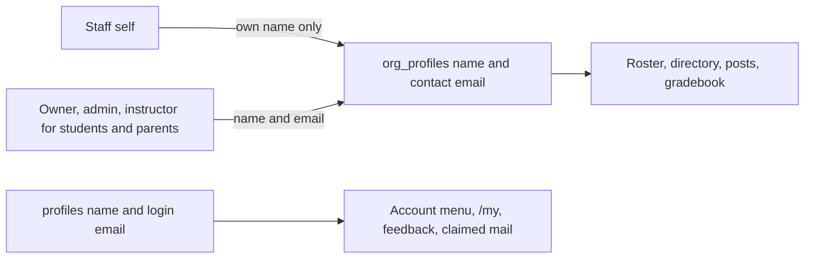

# Org profiles — unified organizational person plan

**Status:** implemented in `supabase/migrations/20261011000000_org_profiles.sql` and the app. A throwaway preview branch cloned from production applied the migration. pgTAP then caught two rewriter bugs (claim bypass flag, and any org person counting as a student); those are fixed in that migration. Local Docker still cannot start a database, so `supabase test db` was not run locally.  
**Supersedes:** staff-only `org_staff_profiles` slice (former title of this file).  
**Global Auth `profiles`:** unchanged (PK = `auth.users.id`).  
**Org SoT:** one **`org_profiles`** row per person in an organization — generalizing the existing [`student_profiles`](../database/SCHEMA.md) pattern. Auth account is optional until claim.

## Problem

Owners/admins need to:

1. **Add** people (staff, students, and later parents as relationships) with **name + email** without requiring an account or sending email immediately.
2. Optionally **send** a claim link later.
3. Let invitees see pending org access after signup (same email), without the magic link.
4. Assign **course teachers**, **class leads**, **enrollments**, and **class membership** **before** the person claims.
5. Allow **one person** to hold multiple privileges and relationships at once (e.g. a parent who is also a student in another class; a student who is also a teacher).

Today those concerns are split: pending staff live only on `admin_invites`; students already have org-scoped `student_profiles` with nullable `user_id`; parents are `parent_student_links` keyed on **`parent_user_id`**; `course_instructors` / `class_leaders` require **`user_id`**. There is no single org person row for staff before claim, and no unified directory for multi-role people.

Inside an org, names shown today for staff, parents, and discussion authors come from `profiles.name`, which the person edits on Account settings. Students already have an organizer-set `student_profiles.name`, but a claimed student can still change how they appear wherever the UI reads the account name.

## Locked decisions (still apply)

| Decision | Lock |
|----------|------|
| Auth `profiles` | Global; PK = `auth.users.id`. Not replaced by org profiles. Account name and login email stay here. |
| Org person SoT | **`org_profiles`** — one row per person per org. Org **name** and contact **email** live here; `user_id` null until claim. |
| Name and email split | In-org name and contact email are organizer-managed. Account `profiles.name` may differ and is never copied either direction on claim. See [Name and email](#name-and-email). |
| Privileges vs relationships | **Org-level privileges** (owner / admin / instructor / observer — “teacher” in product language means instructor privilege + course assignment) live as **permissions on / via the claimed profile**. **Parent is not an org-level role** — it is a **relationship** to a specific student `org_profiles` row. |
| Multi-role | One person may hold multiple privileges and relationships at once (parent + student; student + instructor; etc.). One org row has one name. |
| Claimed privilege layer | **`memberships`** remain the **claimed** privilege layer only (exclusive staff role + additive flags as today). No membership (and no permission) until `org_profiles.user_id` is set via claim. |
| Course / class config before claim | Allowed on the org profile; runtime privilege still requires claim + membership. |
| Families | Keep keying the directory off the **student** org profile row (same as today’s `student_profiles`); FKs keep the column name `student_profile_id` and point at `org_profiles`. |
| Class / Family | Not billing or access containers. Course access stays enrollment + parent links (relationship), not family membership. |
| Observer | Never billing mutate; browse helpers as already locked on main. Observers may edit their own org name. |
| Role vocabulary | Membership exclusive role is **`instructor`** (never “teacher” in schema). |
| Student billing flag | `org_profiles.counts_as_student`. Not “has an enrollment,” and not `memberships.is_student`. |

## Two kinds of “role”

```text
org_profiles (person in org)
├── Org-level privileges (claimed → memberships)
│     owner | admin | instructor | observer
│     → gates Collaborators, course manage, staff chrome, etc.
└── Relationships (can exist before or after claim)
      parent → specific student org_profile(s)   [not an org privilege]
      student context → counts_as_student, enrollments, class_members, grade_level, …
      course teacher / class lead assignments → course_instructors / class_leaders
```

- **Privilege:** “Can this claimed person administer / instruct in this org?” → `memberships` (after claim).
- **Relationship:** “Is this person the parent of *that* student?” → link rows between two `org_profiles`, not a membership role named `parent` as the sole model.
- A person can be a **parent of one student** and a **student themselves** in another class (or the same org) because those are different attachments on the same `org_profiles` row.

## Name and email

Two identities. They may differ, including across organizations. One auth user in two orgs has two org rows and can have two org names.



### Account (`profiles`)

- `profiles.name` is the person’s own name, edited only on Account settings. Signup still collects it.
- `profiles.email` is the login email, synced from Auth, read-only in the app.
- Used outside a single organization: account menu, `/my`, feedback, and the inbox for mail to a claimed account.
- Account settings never writes `org_profiles`.

### Org person (`org_profiles`)

- `name` and `email` are how that person exists **in that organization**.
- In-org UI reads these fields only, with **no fallback** to `profiles.name`: roster, collaborators, directory, discussions, announcements, gradebook, submissions (“on behalf of”), class leads, and course teachers. An account rename cannot change the roster.
- Claim does **not** copy either name onto the other. Do not seed `profiles.name` from the org name when the account name is empty.

### Contact email vs login email

- `org_profiles.email` is the organizer-managed contact email. It replaces today’s `student_email` and the lack of any staff contact email besides login.
- Nullable. Students can still exist with no email. Staff and parent rows created from an account or invite always have one.
- Lowercased. Unique per org when set: one non-null email per organization.
- May differ from `profiles.email` after claim. Changing it **keeps** `user_id` and membership. Detaching the login is a separate organizer action (today’s clear-`user_id` behavior, no longer a side effect of editing email).
- Before claim, a pending invite’s `email` tracks this field. An organizer edit deletes the old pending invite and inserts a fresh token at the new address when the new email is non-null (same rotation as today’s unclaimed student invite).
- Claim still requires the login email to match the **invite** email at claim time.
- Same-email merge uses the org contact email, not the login email.
- `parent_email` on a student row stays “first parent address for search,” not this person’s email.
- Mail to a **claimed** account (announcements, report cards, activity) keeps using `profiles.email`. Invite mail uses the org contact email. The public directory still hides email; staff see the org email on settings and roster.
- `get_org_person_profile` returns the org name and still omits email.
- Historical report-card `snapshot` JSON and already-sent `recipient_email` values stay as stored. New sends use the login email for claimed recipients.

### Who can write the org fields

| Who | Org name | Org email |
|-----|----------|-----------|
| Owners and admins | Anyone in the org | Anyone in the org |
| Instructors | Student records, and a parent when they add or edit that parent. Not other staff. | Same as name |
| Owner, admin, instructor, or observer editing **themselves** | Yes | No |
| Parent-only or student-only | No | No |

A parent or student who also has a staff role can edit the one org name, because they are staff. One row, one name.

When implemented, RLS is: owners/admins pass an org-admin check; instructors pass only when the target row `counts_as_student` or is the parent side of a parent link; self-service name updates require `user_id = auth.uid()` and an active membership whose exclusive role is `owner`, `admin`, `instructor`, or `observer`.

### Student-record flag

Every current `student_profiles` row is a student even with zero enrollments, so “has an enrollment” is not the discriminator.

- `counts_as_student boolean not null default false` on `org_profiles`.
- Billing counts rows where this is true. Staff-only and parent-only rows are false.
- Creating a student sets it true. Creating staff or a parent sets it false. Merging a student invite onto an existing staff row sets it true and leaves it true. It does not turn off if they later also become staff.
- `memberships.is_student` stays the claimed-account flag. Do not overload it as the billing flag.

## Architecture


| Piece | Role |
|-------|------|
| `org_profiles` | Canonical **person** in the org; generalizes today’s `student_profiles`. In-org display name and contact email. |
| `admin_invites` | Claim channel; FK `org_profile_id`; keep `email` for the claim match; payload may request privilege and/or relationship setup |
| Enrollments / class_members | Stay on the **student** org profile (`student_profile_id`, same ids) |
| Parent links | `parent_org_profile_id` → student `student_profile_id`. Access joins the parent row’s `user_id`. |
| Course / class staff assignments | `org_profile_id` required; `user_id` nullable until claim. Privilege to *act* still requires claim + instructor/admin/owner membership |
| `memberships` | Claimed privilege layer only |
| Auth `profiles` | Global identity and login email; linked via `org_profiles.user_id`. Not the in-org display name. |

**Out of scope for first ship (unless needed for merge):** rewriting discussions / events / announcement **audiences** onto org profiles (author **display names** do switch to `org_profiles.name`); Track A billing Price IDs; Track B Connect.

## Product behavior

1. Owner/admin **Add person**: name + email (+ optional privilege and/or student fields) → `org_profiles`, **no** auto-email required.
2. **Send email** / copy link when ready (`send-organization-invite`). Person name in the invite comes from the org profile.
3. Signup/login with invited email → pending invites on `/my`. Signup still collects the account name. That name does not replace the org name.
4. Before claim: enroll as student, assign course teacher / class lead, attach parent→student relationships.
5. **Claim**: set `org_profiles.user_id`; create/update **`memberships`** for requested **privileges**; fill `user_id` on staff assignment rows that were placed before claim; parent relationships already on profile links become usable for access once claimed. Do not rename either profile.
6. Multi-role: claiming a student invite on an existing staff profile (or the reverse) **merges onto one** `org_profiles` row when email/org match rules say so — does not create a second person. Merging a student onto staff sets `counts_as_student` and keeps it.

Cancel pending: delete or soft-cancel invite; orphan rules for unclaimed profiles TBD in UI (do not delete a profile that still has enrollments / relationships without confirmation).

## Schema direction

### `org_profiles` (rename from `student_profiles`)

**Rename the table. Keep ids.** Do not introduce a second table and copy rows.

- `id`, `organization_id`
- `name` (required) — org-facing display name
- `email` — organizer-managed contact email; nullable; replaces `student_email` (dropped in the same migration)
- `user_id uuid null` → Auth `profiles`, unique per org when set
- `counts_as_student boolean not null default false`
- Student-only columns stay nullable on the row: `grade_level`, `parent_email`, `created_via_course_id`. No side table.
- UNIQUE `(organization_id, email)` where `email` is not null
- UNIQUE `(organization_id, user_id)` where `user_id` is not null (already on `student_profiles`)

### What stays student-scoped

Child columns that mean “this student” keep the name `student_profile_id`. Postgres FKs follow the table rename. Those columns must reference a row with `counts_as_student`:

- `enrollments`, `class_members`, `family_members`
- `admin_invites.student_profile_id` and `admin_invite_students` (anchor / attached **students**)
- `material_submissions`, `material_submission_uploads`
- `quiz_attempts`
- `report_card_instances`, `notifications.student_profile_id`
- `share_links.student_profile_id`

`family_members.parent_user_id` stays unused for app writes. Do not block this migration on it.

### Person links (`org_profile_id`)

- `admin_invites.org_profile_id` — the person being invited (student, parent, or staff). Required after backfill. `student_profile_id` remains the student anchor for parent and student invites.
- `parent_student_links.parent_org_profile_id` — replaces `parent_user_id`. Unique `(parent_org_profile_id, student_profile_id)`.
- `course_instructors.org_profile_id` and `class_leaders.org_profile_id` — not null. `user_id` becomes nullable for pre-claim placement. Unique on `(course_id, org_profile_id)` and `(class_id, org_profile_id)`. Keep unique `(course_id, user_id)` / `(class_id, user_id)` where `user_id` is not null.

### Privileges (claimed)

- Continue to use **`memberships`** for exclusive `owner` / `admin` / `instructor` / `observer` and additive flags as already locked
- Setting privilege requires a claimed `org_profiles.user_id` matching `memberships.user_id`
- Pre-claim “intended privilege” may live on `admin_invites.role` (staff) until claim

### Relationships

- **Parent:** `parent_org_profile_id` → `student_profile_id`. Access checks join `org_profiles.user_id = auth.uid()`. An unclaimed parent has links and `user_id` null, so no access until claim.
- **Student context:** `counts_as_student`, plus enrollments / class members / grade — not a separate person table
- **Course teacher / class lead:** `org_profile_id` now; `user_id` filled on claim. Acting still requires a claimed staff membership.

### Invites

- `admin_invites.org_profile_id` required for person-anchored invites after backfill
- Parent invites attach **student org profiles** via `admin_invite_students` (already student-profile shaped)
- Same-email merge: if pending staff and pending/claimed student share `(organization_id, email)` on the **org contact email**, **one** `org_profiles` row. Never two claimed `user_id`s for one email in one org. Do not merge two existing student rows that share an email — the migration aborts instead.

## Migration

Experiment mode allows a local wipe via [`scripts/nuke.sh`](../../scripts/nuke.sh) if a dev backfill fails. The migration itself is a **forward, data-preserving** script: beta data keeps student ids, enrollments, and links. Abort the transaction on any hard conflict. Do not silently merge two students.

Run as **one migration** so a failure rolls back. Capture counts in temp tables at the start and assert them at the end. Ship the client, Edge Functions, and RLS in the same release. Do not add a writable `student_profiles` compatibility view.

### 1. Preflight, then abort on hard conflicts

Before any rename, fail with a message that lists the rows if:

- Two `student_profiles` in the same org have the same non-null `student_email`.
- A `student_email` equals another person’s `profiles.email` in that org **and** those rows are different `user_id`s (or one is claimed and the other is a different claimed user). Same email is allowed only when it is the same account, or both sides are still unclaimed and will become one row.
- A `parent_student_links` row whose parent’s org cannot be derived (student missing, or parent `profiles` row missing).

A pending invite email that matches an existing student email in that org is **not** a conflict. That is the same-person merge in the steps below.

### 2. Rename and add columns

- `ALTER TABLE student_profiles RENAME TO org_profiles`. Ids stay. Existing FKs follow the rename.
- Add `email text` (same lowercased check as `student_email`).
- Copy `student_email` into `email`. Drop `student_email` and its rotate trigger in this same migration, after the new trigger exists.
- Add `counts_as_student boolean not null default false`, then set it **true on every existing row**.
- Keep `name`, `parent_email`, `grade_level`, `user_id`, `created_via_course_id`.
- Do **not** overwrite any existing `name` with `profiles.name`. Those names are already the organizer’s names.

### 3. Students

No new row. The renamed row is the student.

- `counts_as_student` stays true.
- `name` stays the student name.
- `email` is the old `student_email` (null if they had none). Do not fill a null from the login email. Copying it would invent a contact address the organizer never set.
- `user_id` stays as claimed today.
- Pending `role = student` invites: set `admin_invites.org_profile_id` to that same row. `student_profile_id` stays the anchor.

Nothing in the migration makes a claimed student’s account name equal their org name.

### 4. Staff

For each membership with a non-null `user_id` and exclusive role `owner`, `admin`, `instructor`, or `observer` (active and suspended):

- If an `org_profiles` row in that org already has this `user_id`, **reuse it**. Leave `name` and `counts_as_student` alone. If `email` is null, set it from `profiles.email` only when that value is not already used on another row in the org.
- If none exists, insert one row: `name` = trimmed `profiles.name`, or the email local-part if the name is blank; `email` = `profiles.email`; `user_id` set; `counts_as_student` false.

This is the only place a staff org name is seeded from the account name. It is the initial value, not an ongoing sync. Include observers. A person who is staff and a student keeps the **student** name, not the account name.

### 5. Parents

Existing links all have `parent_user_id` (not null today). There is no unclaimed parent row yet.

For each distinct `(student.organization_id, parent_user_id)` on `parent_student_links`:

- Reuse the org row if this `user_id` is already on `org_profiles` in that org (the parent is already a student or was just inserted as staff). Do not change that row’s name or `counts_as_student`.
- Otherwise insert: `name` and `email` from `profiles`, `user_id` set, `counts_as_student` false.

Then:

- Add `parent_org_profile_id` and backfill every link to that parent row in the **student’s** organization. Abort if any link does not resolve.
- Set the column not null. Unique `(parent_org_profile_id, student_profile_id)`.
- Drop `parent_user_id` in this same migration.

Pending parent invites are not links yet. For each pending `role = parent` invite:

- Find or insert an **unclaimed** org row for `(organization_id, email)` with `counts_as_student` false. Name is the email local-part (invites have no name today). If that email already belongs to a claimed row, point the invite at that row instead of inserting.
- Set `admin_invites.org_profile_id` to the parent row. Leave `student_profile_id` and `admin_invite_students` as the students to attach on claim.

### 6. Pending staff invites

Membership is not created until claim, so pending staff live only on `admin_invites` (`owner`, `admin`, `instructor`, `observer`).

- If `(organization_id, email)` already has an org row (student contact email, parent, or claimed account), set `org_profile_id` to it. Do not insert a second person. Do not change a student name.
- Otherwise insert an unclaimed row: `counts_as_student` false, `email` from the invite, `name` from the local-part, `user_id` null. The organizer can rename before claim.
- Set `admin_invites.org_profile_id`. After backfill it is required for person invites.

### 7. Course teachers and class leads

- Add nullable `org_profile_id` on `course_instructors` and `class_leaders`.
- Backfill from the course or class organization plus `user_id` to the staff org row from step 4. Abort if any assignment does not match. Every current row has a claimed user, so all should match.
- Set `org_profile_id` not null.
- Keep `user_id` for claimed rows. Make `user_id` nullable so a later pre-claim assignment can exist before claim fills it.

Claim of a staff invite sets `org_profiles.user_id` and copies it onto placement rows where `user_id` was null. It does not rename either profile.

### 8. Email trigger

Replace `rotate_student_email_access`:

- Unclaimed, email changed: delete pending invites for that org profile; if the new email is non-null and a pending invite existed, insert a new token.
- Claimed, email changed: update the contact email only. Do not null `user_id`. Do not delete the membership.

Create UNIQUE `(organization_id, email) WHERE email IS NOT NULL` **after** backfill, so a collision fails the migration instead of dropping a person.

### 9. Assertions before commit

- Count of `counts_as_student` rows equals the preflight `student_profiles` count. Ids unchanged.
- Enrollment, class-member, submission, quiz-attempt, and report-card counts unchanged.
- Every parent link has `parent_org_profile_id`. Link count unchanged.
- Every membership with a `user_id` and exclusive role owner, admin, instructor, or observer has exactly one org row with that `user_id` in that org.
- Every former `parent_student_links` parent user has an org row in the student’s org.
- Every pending person invite has `org_profile_id`.
- No duplicate `(organization_id, user_id)` and no duplicate non-null `(organization_id, email)`.
- Zero student `name` values changed by the migration (compare to a preflight name snapshot).
- Staff-only and parent-only inserted rows are `counts_as_student = false`.

### 10. App and RLS in the same release

The rename breaks `student_profiles` queries. Ship together:

- Client databridge and regenerated `database.types.ts`
- Edge Functions: `send-organization-invite` (name from the org profile), announcement mail, report-card mail (claimed recipients still use `profiles.email`)
- Helpers: `student_owns_profile`, `parent_linked_to_student` (join the parent org profile’s `user_id`), `claim_invite`, `get_org_person_profile`, and the email-rotation trigger

Do not ship a partial backfill. Prefer fixing forward. Local reset: `scripts/nuke.sh`.

## App work (when implementing)

| Area | Changes |
|------|---------|
| Databridge / types | `org_profiles` as person API; regenerate `database.types.ts`. In-org labels read `org_profiles.name`. |
| Org settings Collaborators | Add person; privileges; send invite; pending rows. Staff can edit their own org name here or on their org profile; not on Account settings. |
| Roster / courses | Pickers accept org profile id (pending or claimed). Student name and contact email stay organizer-edited. |
| Parent flows | Create/link parent org profiles; relationships UI. Parent-only members cannot edit the org name. |
| Account settings | Still edits `profiles.name` only. |
| Edge `send-organization-invite` | Person name from org profile. Invite address is the org contact email. |
| Billing helpers | Student meter = `counts_as_student` rows only |
| Docs | SCHEMA, FEATURES, ORG_SETTINGS, USER_PROFILE, ACCOUNT_SETTINGS, domain AGENTS — mark **shipped** when the feature ships |

## Implementation todos

- [x] Email nullability and student discriminator: `email` nullable; `counts_as_student` boolean (locked above)
- [ ] Migration: `org_profiles` rename, relationship + assignment FKs, RLS, claim updates, **hard backfill** in one transaction
- [ ] pgTAP: multi-role claim; parent link on profiles; staff placement; student enrollment preserved; merge same email; email edit does not clear `user_id`; student account rename does not change org name; observer can rename self and cannot change org email
- [ ] App: Collaborators, pickers, parent directory, invite UX, in-org display names
- [ ] Billing meter remapping + Track A plan note
- [ ] FEATURES / SCHEMA / page docs → **shipped**

## Test plan

- Backfill: memberships + student_profiles + parent links + pending invites → consistent `org_profiles` with no duplicate people.
- Migrated student: roster name unchanged; editing Account settings does not change the roster; organizer email edit leaves `user_id` set.
- Student and staff with the same `user_id` in one org: one row, student name kept, `counts_as_student` true.
- Parent who is also an instructor: one row; they can edit the org name; a parent-only member cannot.
- Observer can edit their own org name and cannot edit their org email.
- Pending staff invite whose email matches a student: one row, student name kept, invite points at it.
- Two students sharing an email: migration aborts.
- Enrollment and parent-link counts match preflight.
- Claim staff with course placement → teaches after claim; unclaimed cannot manage. Claim does not rename either profile.
- Claim student on a profile that is already a parent relationship → `counts_as_student` / student access stacks; one profile.
- Parent access still enrollment-gated via linked student profiles.
- Family directory still lists student profiles (same ids).
- Billing count equals `counts_as_student` rows, not every org profile.
- Manual: existing members still appear correctly in Collaborators after migration, under the org name.

## References

- Schema today: [SCHEMA.md](../database/SCHEMA.md) (StudentProfile, Membership, Enrollment, ParentStudentLink, ClassMember, CourseInstructor)
- Former staff-only approach: replaced by this document (same path historically `ORG_STAFF_PROFILES.md`)
