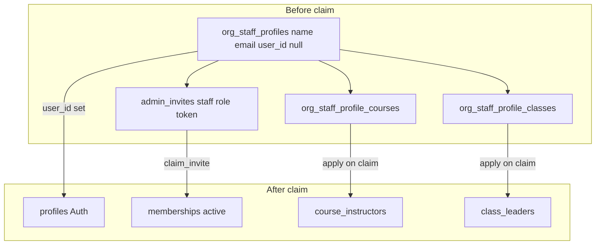

# Org staff profiles — implementation plan

**Status:** planned  
**Global Auth `profiles`:** unchanged (PK = `auth.users.id`). This adds an **org-scoped** staff directory row, parallel to [`student_profiles`](../database/SCHEMA.md).

## Problem

Owners/admins need to:

1. **Add** collaborators with **name + email** without sending email immediately.
2. Optionally **send** the claim link later.
3. Let invitees see pending org access after signup (same email), without the magic link.
4. Assign **course teachers** and **class leads** (configuration only) **before** the person claims.

Today, pending staff exist only on `admin_invites` (email + token). `course_instructors` and `class_leaders` require `user_id`. There is no org person row for staff before claim.

## Architecture



| Piece | Role |
|-------|------|
| `org_staff_profiles` | Canonical **name + email** in the org; `user_id` null until claimed |
| `admin_invites` (staff) | Claim channel: `role`, `token`, `accepted_at`; FK `org_staff_profile_id`; keep `email` for inbox/RLS |
| `org_staff_profile_courses` | Pre-claim co-teacher → `course_instructors` on claim |
| `org_staff_profile_classes` | Pre-claim class lead → `class_leaders` on claim |
| `memberships` | Still created/updated on claim (privilege model unchanged) |
| Runtime course/class rows | Still **`user_id`**; filled from placement junctions at claim |

**Out of scope:** discussions, events, announcement audiences; parent/student invite shape.

## Product behavior

1. Owner/admin **Add**: name + email + role → `org_staff_profiles` + pending staff `admin_invites`, **no** auto-email.
2. **Send email** / copy link on pending row (`send-organization-invite`).
3. Signup/login with invited email → **Invites** on `/my` (existing `admin_invites` email match).
4. Before claim: assign course teacher / class lead via placement tables.
5. **Claim** (`claim_invite`): membership + set `org_staff_profiles.user_id` + materialize `course_instructors` / `class_leaders` + clear placement junctions.

Cancel pending collaborator: delete staff profile (cascade invite + placements) or cancel invite per UI rules.

**Name on claim:** if `profiles.name` is empty/default, set from `org_staff_profiles.name`.

## Schema (new migration)

### `org_staff_profiles`

- `id bigserial` PK  
- `organization_id` → `organizations` ON DELETE CASCADE  
- `name text not null`  
- `email text not null` (lowercase check)  
- `user_id uuid null` → `profiles` ON DELETE SET NULL  
- timestamps  
- UNIQUE `(organization_id, email)` WHERE `user_id IS NULL`  
- UNIQUE `(organization_id, user_id)` WHERE `user_id IS NOT NULL`  

### `admin_invites`

- `org_staff_profile_id bigint null` → `org_staff_profiles` ON DELETE CASCADE  
- Staff roles (`owner`, `admin`, `instructor`, `observer`): `org_staff_profile_id` required (after backfill)  
- Trigger: keep `admin_invites.email` = staff profile email on write  

### Placement tables

- `org_staff_profile_courses (org_staff_profile_id, course_id)` — org match trigger  
- `org_staff_profile_classes (org_staff_profile_id, class_id)` — org match trigger  

### RLS

- Org admins: CRUD staff profiles and placements in their org  
- Members: read claimed staff profiles in org (directory)  
- Placements: admin-managed; validate org on course/class  

### `claim_invite` (staff)

After existing membership logic:

1. `UPDATE org_staff_profiles SET user_id = caller WHERE id = invite.org_staff_profile_id`  
2. `INSERT INTO course_instructors / class_leaders` from junctions (`ON CONFLICT DO NOTHING`)  
3. Delete applied junction rows  

### Tests

- pgTAP: profile + invite + course placement → claim → `user_id` + `course_instructors`  
- Duplicate pending email per org rejected  
- Parent/student invites unchanged  

## App work

| Area | Changes |
|------|---------|
| `src/organizations/databridge/` | `addOrgStaffCollaborator`, pending list, cancel |
| Org settings | Name + email + role form; **Add**; pending list; **Send email** |
| `src/courses/` | Picker + lists use `staffProfileId` for pending; `listOrgStaffForPicker` union |
| `src/roster/class-roster/` | Class leads same pattern |
| `supabase/functions/send-organization-invite/` | Include staff profile name in payload |
| `database.types.ts` | Regenerate after migration |

Docs: update [SCHEMA.md](../database/SCHEMA.md), [FEATURES.md](../FEATURES.md), [ORG_SETTINGS.md](../pages/ORG_SETTINGS.md), domain `AGENTS.md` files when shipped.

## Implementation todos

- [ ] Migration: tables, RLS, triggers, `claim_invite`, **hard backfill** (below)  
- [ ] pgTAP + unit tests  
- [ ] Databridge + org settings UI  
- [ ] Course/class picker and pending rows in teacher lists  
- [ ] Edge function name field  
- [ ] FEATURES / SCHEMA / page docs → **shipped** when done  

---

## Hard migration (required — not lazy-only)

Experiment mode allows doing this in one squashed migration set. **Every** existing staff collaborator and **every** pending staff invite must get an `org_staff_profiles` row; the app must treat that table as the **directory source of truth** for collaborators (not membership-only listing).

### Principles

1. **One staff profile per** `(organization_id, user_id)` for claimed staff.  
2. **One pending profile per** `(organization_id, email)` for unclaimed staff invites.  
3. **Link** all staff `admin_invites` to `org_staff_profile_id` (pending and historical accepted rows where still useful).  
4. **Do not** re-FK `course_instructors` / `class_leaders` to `org_staff_profile_id` in this slice — existing rows stay on `user_id`; only **new pre-claim** placements use junctions until claim.  
5. After backfill, **Collaborators UI** lists from `org_staff_profiles` joined to `memberships` (when `user_id` set) or pending `admin_invites` (when not).

### Migration steps (SQL order)

**Step 1 — Create** `org_staff_profiles`, placement tables, `admin_invites.org_staff_profile_id`, constraints, RLS, triggers (empty).

**Step 2 — Backfill claimed staff** from active memberships:

```sql
insert into public.org_staff_profiles (organization_id, name, email, user_id)
select
  m.organization_id,
  coalesce(nullif(trim(p.name), ''), p.email),
  p.email,
  m.user_id
from public.memberships m
join public.profiles p on p.id = m.user_id
where m.status = 'active'
  and m.role in ('owner', 'admin', 'instructor', 'observer')
on conflict do nothing;
```

(Use the partial unique indexes above; adjust conflict target to match migration definitions.)

**Step 3 — Backfill pending staff invites** (no profile yet for that org+email):

```sql
insert into public.org_staff_profiles (organization_id, name, email, user_id)
select distinct on (i.organization_id, i.email)
  i.organization_id,
  coalesce(nullif(trim(i.invitee_name), ''), split_part(i.email, '@', 1)),
  i.email,
  null
from public.admin_invites i
where i.accepted_at is null
  and i.role in ('owner', 'admin', 'instructor', 'observer')
  and not exists (
    select 1 from public.org_staff_profiles osp
    where osp.organization_id = i.organization_id
      and osp.email = i.email
  );
```

(Add `invitee_name` on `admin_invites` in the same migration if not present; nullable for old rows.)

**Step 4 — Link invites to profiles**

```sql
update public.admin_invites i
set org_staff_profile_id = osp.id
from public.org_staff_profiles osp
where i.role in ('owner', 'admin', 'instructor', 'observer')
  and osp.organization_id = i.organization_id
  and osp.email = i.email
  and i.org_staff_profile_id is distinct from osp.id;
```

**Step 5 — Enforce staff invite invariant** (after backfill):

- CHECK or trigger: staff roles require non-null `org_staff_profile_id`.  
- New staff invites must insert profile first (app + DB trigger on `admin_invites` insert).

**Step 6 — Verification queries** (run in migration test / manual checklist):

- Count active staff memberships vs claimed `org_staff_profiles` per org — must match.  
- Count pending staff invites vs pending profiles (`user_id is null`) per org+email — must match.  
- Zero staff `admin_invites` with null `org_staff_profile_id` after backfill.

### App migration (same release)

| Before | After |
|--------|--------|
| `listOrgStaff` from `memberships` only | Primary list: `org_staff_profiles` + join `memberships` on `user_id` + role from membership; pending: join open staff `admin_invites` for role + token actions |
| Pending invites list from `admin_invites` only | Same data via staff profile as display row (name, email) |
| `listOrgStaffForPicker` memberships only | Union pending profiles (`user_id is null`) + active staff profiles / memberships |

Remove code paths that assume “no org_staff_profile for existing members.”

### Rollback / experiment mode

In experiment mode, prefer fixing forward in migrations over incremental backfill scripts. If backfill fails mid-migration, fix SQL and re-run `scripts/nuke.sh` locally — do not ship partial backfill to production until verification passes.

### Future (not this plan)

- Optional `course_instructors.org_staff_profile_id` to keep a stable org-person FK after claim (dual-write then cut over).  
- Unified `org_people` merging staff + student directory rows.  
- Parent/student pre-claim config on staff profiles.

## Test plan

- pgTAP backfill: seeded memberships + pending invites → all linked profiles.  
- Claim with placements → course/class rows exist.  
- Manual: add named collaborator without email → assign course → new user accepts → teaches course.  
- Manual: existing member from before migration still appears in Collaborators with correct role.
