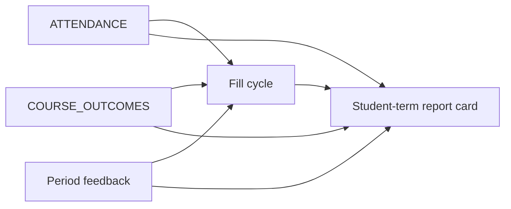

# Report cards — org templates, assemble, and fill cycles

**Status:** in progress — fill cycles and period feedback are in the app (US-83, US-84). Templates, assemble, and send stay later (US-85–87). Section toggles for outcomes and period feedback stay off.  
**Builds on:** shipped Progress — grading report cards (draft → submit → email, grade snapshot + comment)  
**Prerequisites (implement first, as their own plans):**

| Plan | Why |
|------|-----|
| [ATTENDANCE.md](./ATTENDANCE.md) | Day/class/course capture; cycle **attendance submit** packages that roll into the card |
| [COURSE_OUTCOMES.md](./COURSE_OUTCOMES.md) | Outcome / criterion ratings only (no freeform feedback there) |

**Also in this plan (not separate prereq files):** period **teacher feedback**, **class-lead feedback**, fill cycles, student-term assemble/send.

**Domains:** `src/grading/` · attendance · outcomes · org branding · staff home  
**Migrations:** TBD after prerequisites land (experiment mode)

## Problem

Today a report card is a **fixed**, **per-course** layout that one teacher drafts and sends. Organizations need:

1. A **template** (print format + body sections), including configurable term label on print.
2. **Class leads / owners / admins** to **create** one card **per student per term**.
3. **Course teachers** to fill the pieces the card pulls from (outcomes, period feedback, attendance package, grades).
4. **Fill cycles** with soft due dates so “Q3 materials due X” shows on the staff home, plus class-lead assemble reminders.

## Product intent

| Need | Intent |
|------|--------|
| Org template | **Owners and admins** define print format + body sections (v1: one template) |
| Format | **Print** masthead only. Screen always shows full identity |
| Who creates | **Owners, admins, class leads** only. Class leads: students in a class they lead. Course teachers **never** create cards |
| Who fills sources | Course teachers (and owners/admins) fill outcomes, period feedback, attendance submit, etc. Class lead assembles / may override incomplete segments |
| Card shape | **One card per student per term** — body may include blocks from multiple courses |
| Period feedback | **Separate** from outcomes — freeform teacher narrative per course×student×cycle so a course with no outcomes can still contribute feedback if the template includes that section |
| Class-lead feedback | Owners/admins may **request** class-lead feedback on the card; template configures **where** that block prints |
| Fill cycles | Bundled due work for every template dependency in scope; soft due dates; home to-dos |
| Snapshot on send | Point-in-time copy when the card is submitted/sent |

## Prerequisites

1. Attendance capture + cycle attendance submit ([ATTENDANCE.md](./ATTENDANCE.md)).
2. Course outcomes ratings ([COURSE_OUTCOMES.md](./COURSE_OUTCOMES.md)).
3. Period feedback + fill cycles + assemble can land with this plan (period feedback has no separate file).



## Locked decisions

| Decision | Lock |
|----------|------|
| Who edits template | **Owners and admins** |
| Who creates cards | **Owners, admins, class leads** only |
| Who fills teacher sources | Course instructors for their courses; owners/admins anywhere |
| Card grain | **One per student per term** (multi-course body) |
| Send while incomplete | **Yes** — missing teacher segments show as N/A (or empty); **class lead may override** by **replacing** that segment with class-lead text (not editing the teacher’s original in place) |
| Multiple class leads | Shared **one** student-term draft. **Any** lead for that student’s classes may open it, add/save **class-lead feedback** (and other assemble edits) **without sending**. Saved work is visible to the other lead(s). **Send** stays available to either lead, but the UI shows a coordination warning (below) |
| Multi-class warning | When the student is in **more than one class**, the assemble/send screen shows a clear note: e.g. **“This student is in multiple classes. Please coordinate with {other class lead names} before sending.”** Does not hard-block send in v1 |
| Course with no outcomes | **Skip** outcomes for that course on the card (no empty outcomes block) |
| Period feedback vs outcomes | **Separate entities**. Outcomes = ratings. Period feedback = freeform, even when the course has zero outcomes |
| Empty / gap data | Teacher **submits** their fill package when ready; gaps are on them. Card still sendable |
| Soft due dates | Past due does **not** lock edits. UI urgency only. Owner/admin may **send reminders** (opt-in action); standing home to-do is the default nudge |
| Home to-dos (v1) | **Home only** — no Activity rows for fill cycles in v1 |
| Teacher home | Personal queue: fill your bundled materials (deep link), e.g. “Q3 materials due Fri — 12 students left in Biology” |
| Class-lead / admin home | **Rollup** of teacher completion (“3 of 5 teachers finished”) **and** reminder to **finish / send report cards** |
| Fill cycle scope | Configurable: label (e.g. Quarter 1) + audience **whole org** / **these classes** / **these courses** |
| Fill cycle contents | **Bundle** — every **enabled template dependency** in that cycle (outcomes, period feedback, attendance submit, **grades** when that section is on the template) shares the cycle due date |
| Term on print | Cycle term label prints when the template’s print format includes the marking-period field |
| Attendance in a cycle | Day/class/course marks stay editable as usual; teachers/leads also **submit an attendance package** for the cycle (review/fix window) so the card uses a deliberate package, not only “whatever was last typed” |
| Class-lead feedback | Owners/admins can require/request it per cycle or template; **placement on the card is a template option** (section order / slot) |
| Family read of sources | Progress / student profile for attendance, outcomes, period feedback (no family write) |
| Old per-course cards | Historical snapshots remain; new create path is student-term only |
| Bulk parent opt-out | Out of scope |

## Format (print masthead)

Unchanged intent: format toggles are **print-only**; screen always shows full identity (student name, grade level, courses involved, status, term, etc.).

### Branding (print)

| Option | Default | Notes |
|--------|---------|-------|
| Show org **logo** lockup | on when org has a logo | Snapshot at refresh/send |
| Show org **name** as text | on | **TBD:** logo-only vs logo + name |
| Logo missing | fall back to org name | |

### Print identity fields

| Field | Source | Default on print |
|-------|--------|------------------|
| Student name | org profile | on |
| Student grade level | grade scheme label | on |
| Term / marking period | **fill cycle label** (e.g. Quarter 3) | on when template enables the field |
| Report date | issued / sent | on |
| Course list / titles | courses on the card | on |
| Course subject | catalog | off |
| Organization name | org | with branding rules |
| Course date range | course dates | off |
| Teacher name(s) | course instructors | off |
| Final grade(s) in masthead | gradebook | off |

## Body section catalog (v1)

| Type | Source | Who fills | Notes |
|------|--------|-----------|-------|
| `grades` | Gradebook per course on the card | Course teachers — **cycle package submit** when `grades` is on the template | Multi-course blocks; live gradebook until submit, then package for the cycle (still soft-due editable) |
| `outcomes` | Criterion/outcome ratings | Course teachers | **Omit course** if it has no outcomes defined |
| `period_feedback` | Freeform narrative per course×student×cycle | Course teachers | Independent of outcomes; include if template enables |
| `attendance` | Cycle attendance **package** (rollup of marks in window + submit) | Class leads / course teachers per attendance rules | Submit ≠ delete day marks |
| `class_lead_feedback` | Narrative from class lead | Class lead (when requested) | Template chooses **where** this sits in section order |
| `assembler_comment` | Optional extra note from creator | Class lead / admin / owner | Distinct from period and class-lead feedback |

### Template options (light)

| Section | Options |
|---------|---------|
| `grades` | Assignment rows vs final only |
| `outcomes` | Criteria vs titles · hide unset |
| `period_feedback` | Label (“Teacher comments”) · per-course heading |
| `attendance` | Counts vs short legend |
| `class_lead_feedback` | Label · enabled when owners request class-lead feedback |
| Print term field | on/off (value from cycle label) |

## Roles and queues

```text
Owner / admin
  ├── configure template (format, sections, class-lead feedback placement)
  ├── create fill cycles (label, due date, audience, bundled dependencies)
  ├── optional: send reminders
  ├── create / send any student card
  └── home: org rollup + assemble reminders

Class lead
  ├── fill attendance (class) + own course sources if also a teacher
  ├── create / assemble / send cards for students in their class
  ├── replace incomplete teacher segments with class-lead text when sending
  ├── save class-lead feedback without sending (visible to other leads on the shared draft)
  ├── see multi-class coordination note before send when applicable
  └── home: “finish report cards” + teacher completion rollup for their class

Course teacher
  ├── fill outcomes / period feedback / course attendance package for their courses
  ├── submit fill package for the cycle (soft due)
  └── home: personal fill to-do with deep link
  ✗ does not create report cards
```

## Create and assemble flow

1. Owner/admin opens a **fill cycle** (e.g. Quarter 3, due date, whole org or selected classes/courses). Bundled dependencies match enabled template sections.
2. Teachers see home to-dos → fill → **Submit** their package (gaps allowed).
3. Class lead / admin / owner **creates** the student-term draft (class roster or student profile). One draft per student×cycle — shared across leads.
4. Draft **Refresh** pulls submitted (or latest) source data; incomplete → N/A unless a class lead **replaces** that segment with their own text.
5. Class leads **save** feedback (and assemble edits) anytime; other leads see those saves on the same draft. Saving ≠ sending.
6. If the student is in multiple classes, show: **“This student is in multiple classes. Please coordinate with {other lead names} before sending.”**
7. **Submit and send** (either lead / admin / owner) freezes snapshot; email / Activity for families as today.
8. Class-lead home also reminds them to finish unsent cards for the cycle.

## Staff fill cycles & due dates

### Cycle fields (sketch)

| Field | Notes |
|-------|-------|
| organization_id | |
| label | “Quarter 3”, “Week 12”, … — also feeds print term when format enables it |
| due_on | date — **soft** |
| audience | `organization` · `classes` · `courses` |
| class_ids / course_ids | when audience is classes/courses |
| bundled_dependencies | which template-linked work is in this cycle (derived from template + explicit bundle flags) |
| request_class_lead_feedback | boolean |
| created_by | owner/admin |

### Dependency kinds (bundle members)

| Kind | Done when | Skip when |
|------|-----------|-----------|
| `outcomes` | Teacher **submitted** outcomes package for that course×cycle | Course has **no outcomes defined** → not in that teacher’s queue for outcomes; card skips outcomes for that course |
| `period_feedback` | Teacher **submitted** period feedback package | Section off on template → not in cycle |
| `attendance` | Responsible staff **submitted** attendance package for the cycle window | Section off → not in cycle |
| `grades` | Teacher **submitted** grades package for that course×cycle (when `grades` is on the template) | Section off on template → not in cycle |

### Attendance package

Daily capture continues as in [ATTENDANCE.md](./ATTENDANCE.md). For a fill cycle, the responsible person also **submits attendance** for the cycle’s date window — a deliberate checkpoint to review/fix marks before the card uses them. Submitting does not freeze forever (soft due; still editable); it marks the dependency complete for rollup/home.

### Home UI (v1)

| Audience | Example |
|----------|---------|
| Course teacher | “**Quarter 3** materials due Fri — Biology: 12 students left” → fill UI |
| Class lead / admin | “**Quarter 3** — 3 of 5 teachers finished” + “**4 report cards** left to send for Homeroom A” |
| Owner | Org-wide rollups + cycle admin |

Reminders: owner/admin **opt-in send** (not automatic Activity in v1). Standing home to-do is always on while incomplete and due date applies.

## Data sketch

### `report_card_templates`

| Field | Notes |
|-------|-------|
| organization_id | unique in v1 |
| format | jsonb print toggles |
| sections | jsonb ordered body sections + options (includes `class_lead_feedback` placement) |

### `report_card_fill_cycles`

As in [cycle fields](#cycle-fields-sketch).

### `report_card_fill_submissions`

| Field | Notes |
|-------|-------|
| cycle_id | |
| dependency_kind | outcomes · period_feedback · attendance · … |
| course_id / class_id | scope of the package |
| submitter_user_id | |
| submitted_at | |
| unique | one open submission per cycle×kind×scope×submitter (or upsert) |

### Period feedback (entity)

| Field | Notes |
|-------|-------|
| cycle_id | ties feedback to the term |
| course_id | |
| student_profile_id | |
| body | text |
| author | course teacher |
| unique | (cycle_id, course_id, student_profile_id) |

### Class-lead feedback

| Field | Notes |
|-------|-------|
| report_card_instance_id or (cycle_id, student_profile_id) | |
| body | text |
| author | class lead |
| multi-lead | Same draft. Each lead may **save** their feedback (and see the other’s saved feedback) without sending. Send is a separate action with the multi-class coordination note when applicable |

### `report_card_instances` (evolve)

- Grain: **student + cycle** (term), not only enrollment  
- `snapshot` includes template, identity, per-course grades/outcomes/period_feedback, attendance package, class_lead_feedback, overrides  
- Keep reading historical enrollment-scoped rows

Migration strategy for old cards: leave as-is; new creates use student+cycle.

## Settings UX

1. **Print format**  
2. **Sections** (incl. where class-lead feedback appears)  
3. **Fill cycles** — create/list; audience; due date; request class-lead feedback; optional Send reminders  

## App / domain notes

- Teachers: fill UIs in outcomes / period-feedback / attendance domains.  
- Class leads: assemble UI in `src/grading/report-card/`.  
- Staff home: to-do region for fill + assemble queues.  
- Print CSS = format; screen = full identity.

## Out of scope (v1)

- Designed PDF packets  
- Activity notifications for fill cycles  
- Automatic reminder emails (manual/opt-in only)  
- Parent-editable cards  
- Course-teacher-created cards  

## Open questions (remaining)

1. Print logo: logo only vs logo + org name?  
2. Null print fields: omit vs em dash?  
3. Multiple templates in v1, or one?  
4. Prerequisites must be `shipped` before their section toggle enables — **yes**.  
5. After first **send**, block further send from another lead (resend / new card only), or allow a second send? Propose: status `sent` → no second full send; use existing resend-delivery path for failed email only  
6. Multi-class note: list **all other class leads** by org name, or also class names (“coordinate with Ada (Homeroom A)”)?

## Implementation checklist (when building)

1. Prerequisites: attendance (+ package submit) and outcomes  
2. Period feedback entity + fill UI  
3. Fill cycles + submissions + home to-dos + rollups  
4. Template format + sections (incl. class-lead feedback placement)  
5. Student-term create / refresh / override / send  
6. Page outlines + FEATURES status → shipped  

## References

- [FEATURES.md](../FEATURES.md)  
- [pages/REPORT_CARD.md](../pages/REPORT_CARD.md)  
- [ATTENDANCE.md](./ATTENDANCE.md)  
- [COURSE_OUTCOMES.md](./COURSE_OUTCOMES.md)  
- HN-019 report-card email  
